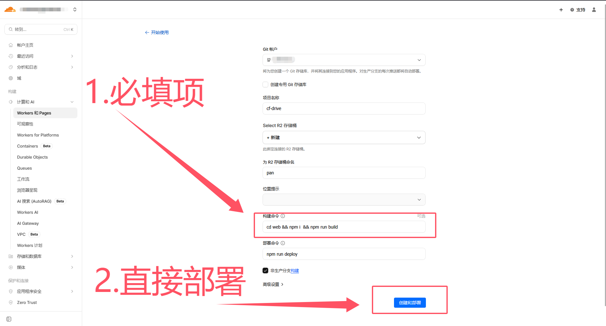

## cf-drive

### 🔱 项目简介

cf-drive 是基于Cloudflare Worker的个人网盘系统，使用Cloudflare R2作为存储方式。

安全起见，网站目前阉割掉了上传功能，**仅保留下载功能**，上传文件需要到Cloudflare的Dashboard处上传文件

> 📌 本项目的前端界面修改自 [FlareDrive-R2](https://github.com/willow-god/FlareDrive-R2)，后端采用[hono](https://github.com/honojs)框架。

### 🚀 一键部署

[](https://deploy.workers.cloudflare.com/?url=https://github.com/only9464/cf-drive)


点击上面的`Deploy to Cloudflare`按钮，等待跳转至`Cloudflare`界面，如下图所示：





上述只需要填写***构建命令***这一项，且必须填写这一项，且必须是：

```bash
cd web && npm i  && npm run build
```

然后点击`创建和部署`项目即可完成

> 📌 注意：上述界面中的**部署命令**不可以更改，其他选项自己根据个人需求可以更改


### ✏️ 本地命令行部署

#### 0.安装npm和wrangler

npm自行搜索安装教程,确定安装好后再安装wrangler命令

```bash
npm i wrangler@latest -g 
```
#### 1.获取代码

```bash
git clone https://github.com/only9464/cf-drive.git --depth 1
```
#### 2.进入项目根目录


```bash
cd cf-drive
```
#### 3.构建前端静态页面
先进入前端源代码目录
```bash
cd ./web
```
然后安装npm依赖
```bash
npm i
```
执行构建命令
```bash
npm run build
```
#### 4.部署到cloudflare上

先退回到项目根目录

```bash
cd ..
```
安装worker项目依赖
```bash
npm i
```

执行部署命令
```bash
wrangler deploy
```

最终终端输出的链接便是你的网盘地址，直接访问即可。
